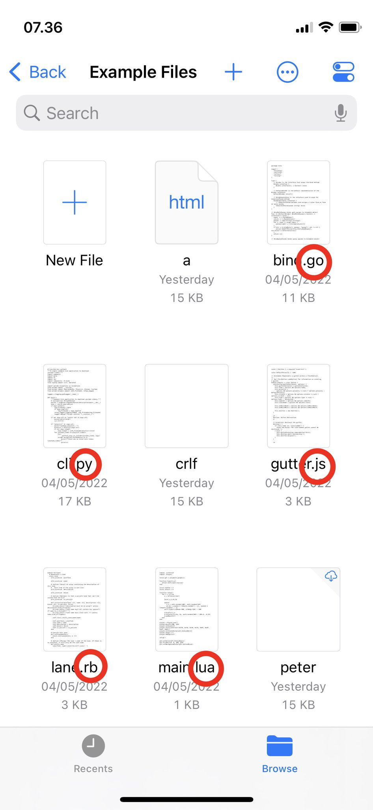

# Setting shouldShowFileExtensions = true on UIDocumentBrowserViewController does not always show file extensions

The documentation for UIDocumentBrowserViewController states that the shouldShowFileExtensions property determines if the document browser should always show file extensions. However, that is not always the case, as shown in the attached screenshot.

The screenshot shows files with different file extensions for all of which UIDocumentBrowserViewController shows the file extension: .go, .py, .js, .rb, and .lua. However, the screenshot also shows three HTML files for which the view controller does not show the file extension (.html). I’ve seen a similar issue with Markdown files (.md) and I can’t rule out that the issue also exists for other file extensions.

The example project shows a simple UIDocumentBrowserViewController with shouldShowFileExtensions set to true.

