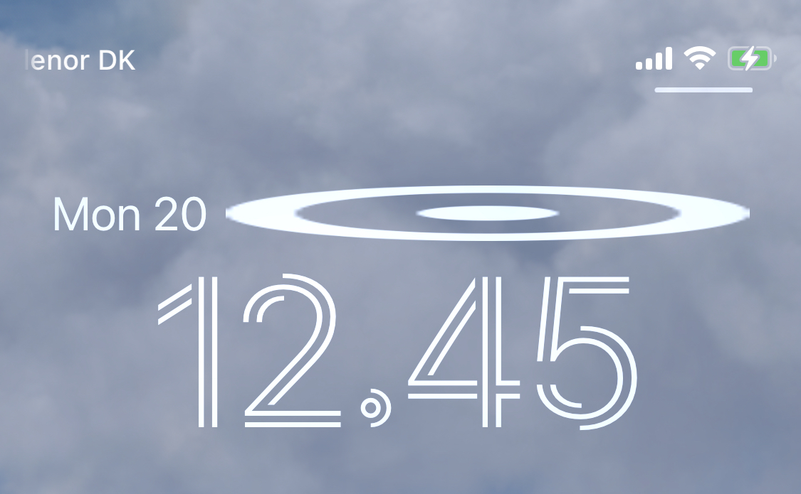

# Custom images in accessory inline widgets are stretched horizontally

When using a custom image, i.e. images created with the Image(_:) initializer, in a widget that’s displayed in the inline accessory slot, the image is stretched horizontally. The issue also happens when displaying an image created using Image(uiImage:) in the inline accessory slot.

This doesn’t happen when displaying a SF Symbol created with Image(systemName:) or when displaying the custom image in any other widget slot on the Lock Screen.

The image is stretched even when applying view modifiers like .resizable(), .fixedSize(), .frame(width: XX, height: YY), and .aspectRatio() on the image.

This issue totally prevents the usage of custom images in the inline accessory widget which poses quite a problem for companies attempting to display custom iconography in the inline accessory widget, essentially preventing us from supporting the inline accessory widget.

Please see the attached image which shows the issue on the Lock Screen and please see the attached example project which can be used to reproduce the issue.

