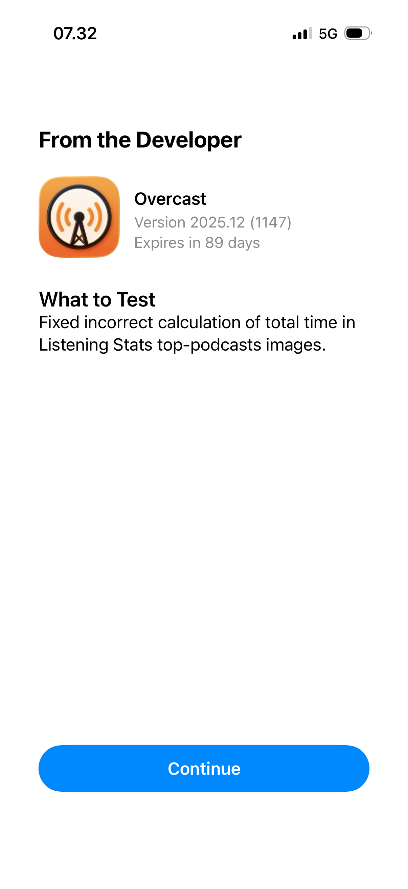

# Show “What’s New” on first launch after app update, similar to TestFlight

Just like TestFlight builds show “What to Test” notes on first launch, Apple should offer developers an option to display the “What’s New in This Version” text the first time users open an updated App Store app. This would be helpful for many developers and their users.

